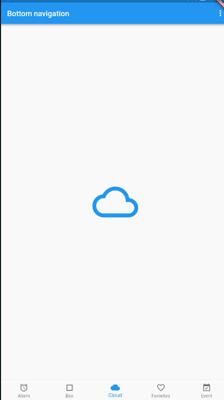
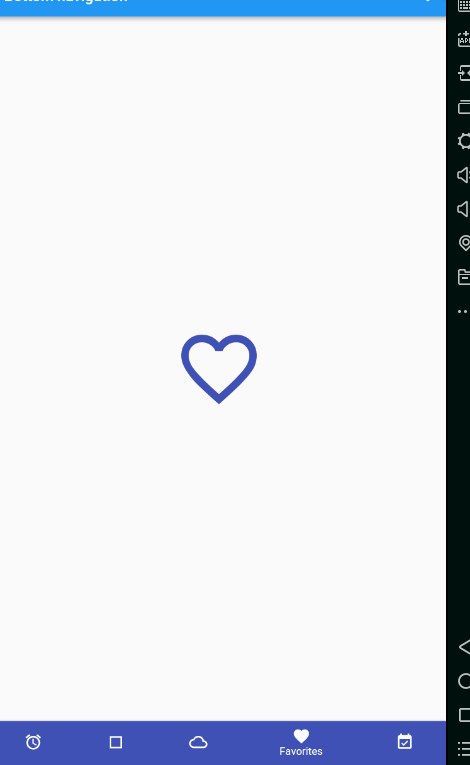

# bottom_navvigation

A new Flutter application.

## Getting Started

For help getting started with Flutter, view our online
[documentation](https://flutter.io/).
使用到的组件
FadeTransition 透明度动画、SlideTransition 相对自己移动的动画、BottomNavigationBarItem 底部bar的item、
BottomNavigationBar 底部tab

